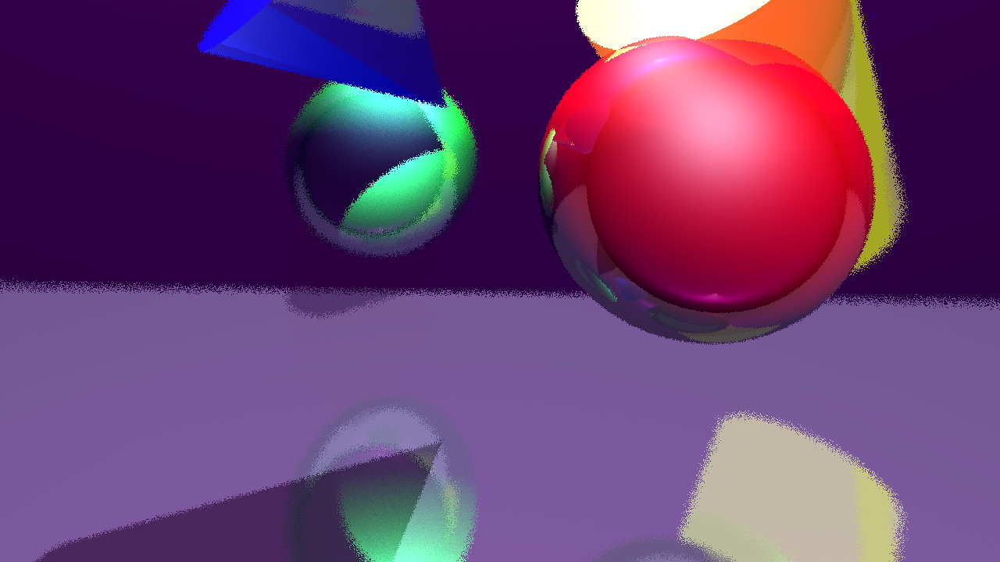
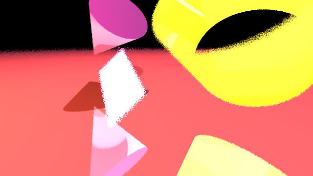
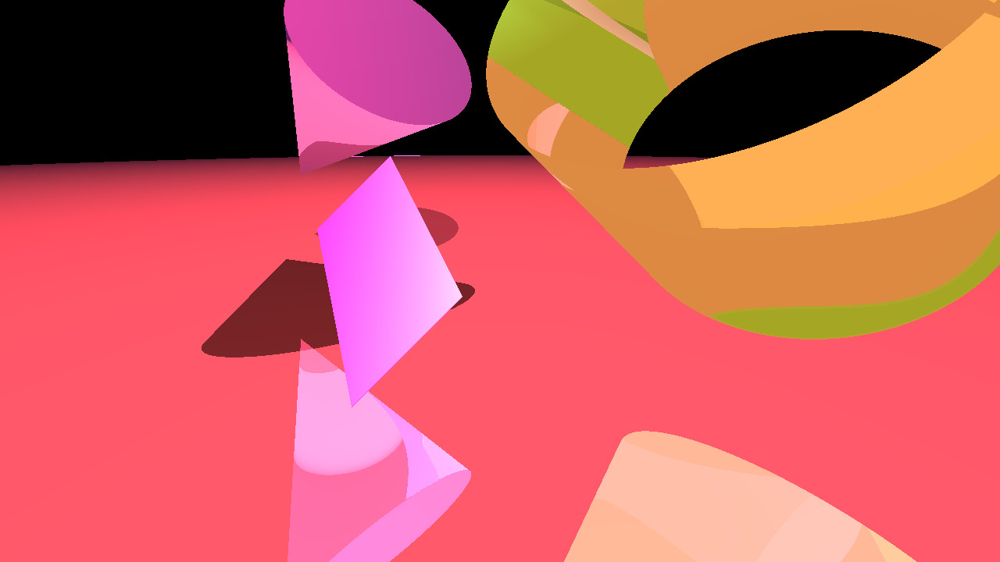

# RayTracer
Raytracing program za projekt pri predmetu računalništvo

## Opis
Program **RayTracer** najprej prebere podatke o sceni (kje so kamera, predmeti in luči) ter nato za vsak piksel na zaslonu izračuna presečišča s predemti in poišče tistega, ki je najbližje kameri.

To program naredi vsakič iz nekoliko drugačne pozicije kamere, da dobimo vtis **DoF** (depth of field) globine.

Nato program določi razdaljo do vsake luči v sceni in tako izračuna končno vidno barvo predmeta na tem mestu.

Program to mesto zapiše na določeno mesto v matriko, kjer nato, če uporabnik to zahteva povpreči po 4 sosednje piksle, za "lepše" robove oz **Anti-aliasing**.

Na koncu program piksle zapiše v datoteko **.ppm**, jo pretvori v **.jpg** in končno sliko prikaže na zaslonu.

### Uporaba virov

Tukaj naj omenim, za katere dele programa sem si pomagal s tujimi viri.

Za opis predmetov v prostoru z **vektorji**, zapis barve v datoteko .ppm, prvi del "rendanja" torej določitev najbližjega predmeta in prikazom napredka (progress bar) sem si pomagal s setom [posnetkov](https://www.youtube.com/user/wavecounter07).

Za presečišče s **kroglo** in "matematično" ozadje delovanja luči, sem si pomagal z računskim prikazom na [povezavi](https://medium.com/swlh/ray-tracing-from-scratch-in-python-41670e6a96f9).

Za dof sem kodo napisal sam, idejo pa sem dobil [tukaj](https://medium.com/@elope139/depth-of-field-in-path-tracing-e61180417027).

Za anti-aliasing sem kodo prav tako napisla sam, idejo pa sem dobil [tukaj](https://computergraphics.stackexchange.com/questions/4248/how-is-anti-aliasing-implemented-in-ray-tracing)

Za pretvorbo datoteke v .jpg in prikaz slike na zaslonu sem si pomagal s [stackoverflow](https://stackoverflow.com/).
___

## Funkcionalnosti programa

- Kamera:
    - DoF
- Luči:
    - Točkaste luči
    - Sence
- Predmeti:
    - Krogla
    - Omejena ravnina
    - Zaprt / odprt valj
    - Stožec
- Materiali:
    - Zrcaljenje - **specular**
    - Odbojnost - **reflection**
- Definicija scene:
    - JSON
- Ostalo:
    - Shranitev slike v .jpg datoteko
    - Prikaz napredka
    - Anti-aliasing
___

## Navodila za uporabo

Uporabnik naj naredi JSON tekstovno datoteko, v katero naj kot v python slovar zapiše  podatke na naslednji način:

```python
    scena = {
        "kamera" : {"pozicija" : [x, y, z],
                    "goriscna razdalja" : float,
                    "zaslonka" : float},
        "sirina" : int,
        "visina" : int,
        "predmeti" : {"ravnina1" :
                        {"normala" : [x, y, z],
                         "pozicija": [x, y, z],
                         "sirina" : float
                         "visina": float
                         "material": {},
                         "senca" : bool},
                    "krogla1":
                        {"sredisce" : [x, y, z],
                        "radij" : float, 
                        "material" : {},
                        "senca" : bool},
                    "valj1":
                        {"pozicija" : [x , y, z],
                        "normala" : [x, y, z],
                        "radij" : float,
                        "visina" : float,
                        "material" : {},
                        "senca" : bool}},
# Stožec in odprt valj imata enake lastnosti kot valj, ključ naj sledi ostalim primerom torej "stozec1" oz "odprt valj1".
        "luci" :  {"luc1" : {"pozicija" : [x, y, z],
                            "material" : {}}},
        "stevilo odbojev" : int,
        "anti aliasing" : bool
    }
```
Število odbojev je globina rekurzije za določitev odbojev od predmeta. Senca pa je lastnost telesa, da predstavlja senco drugem telesu.

Za materiale je potrebno določiti naslednje lastnosti (RGB so po vrsti rdeča, zelena in modra barva):

```python
material = {"barva" : [R, G, B], "ambientalna barva" = [R, G, B], "zrcaljenje" : [R, G, B], "sijaj" = float, "odsev" = float}
```
Material luči nima lastnosti ```"sijaj" ``` in ```"odsev"```. Če kakšna lastnost manjka, bo v primeru, da je lastnost seznam [R, G, B] predvidena vrednost enaka [0, 0, 0] oz v primeru številke enaka 0.0.

___

## Nekaj slik






___

## Viri

- https://www.youtube.com/user/wavecounter07
- https://medium.com/swlh/ray-tracing-from-scratch-in-python-41670e6a96f9
- https://medium.com/@elope139/depth-of-field-in-path-tracing-e61180417027
- https://computergraphics.stackexchange.com/questions/4248/how-is-anti-aliasing-implemented-in-ray-tracing
- Uporabljene knjižnice:
    - [NumPy](https://numpy.org)
    - [Pillow](https://pypi.org/project/Pillow)
    - [Random](https://docs.python.org/3/library/random.html)
    - [math](https://docs.python.org/3/library/math.html)
    - [JSON](https://www.json.org/json-en.html)
    - [Wand](https://pypi.org/project/Wand/)

___